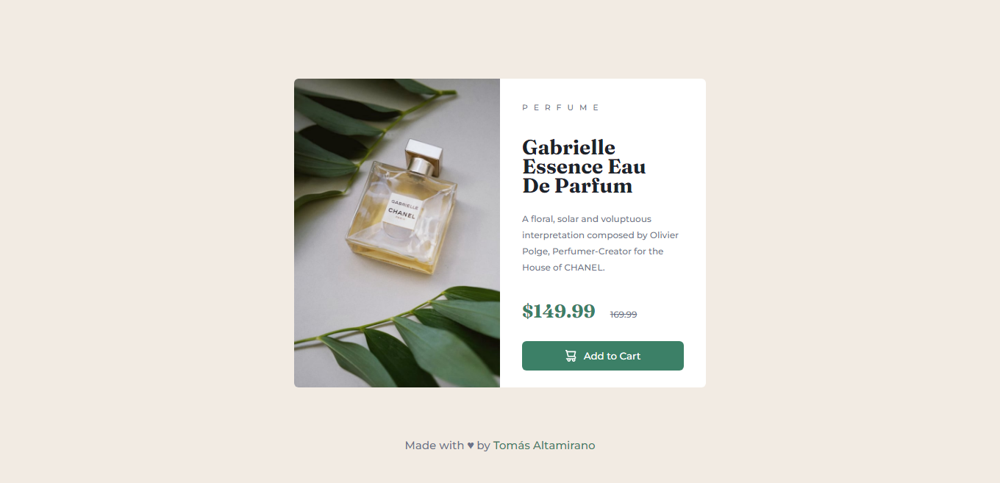

# Frontend Mentor - Product preview card component solution

This is a solution to the [Product preview card component challenge on Frontend Mentor](https://www.frontendmentor.io/challenges/product-preview-card-component-GO7UmttRfa). Frontend Mentor challenges help you improve your coding skills by building realistic projects. 

## Table of contents

- [Overview](#overview)
  - [Screenshot](#screenshot)
  - [Links](#links)
  - [Built with](#built-with)
- [Author](#author)

## Overview

### Screenshot

### Links

- Solution URL: [Repo](https://github.com/tomasaltamirano/Product-preview-card)
- Live Site URL: [Deploy](https://tomasaltamirano.github.io/Product-preview-card/)

### Built with

- Semantic HTML5 markup
- CSS custom properties
- Flexbox

## Author

- Frontend Mentor - [@tomasaltamirano](https://www.frontendmentor.io/profile/tomasaltamirano)
- Twitter - [@tomasltamirano](https://www.twitter.com/tomaltamirano_)
